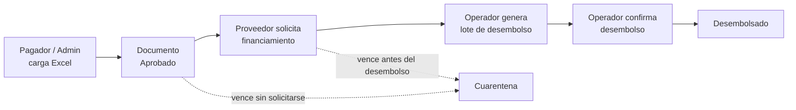
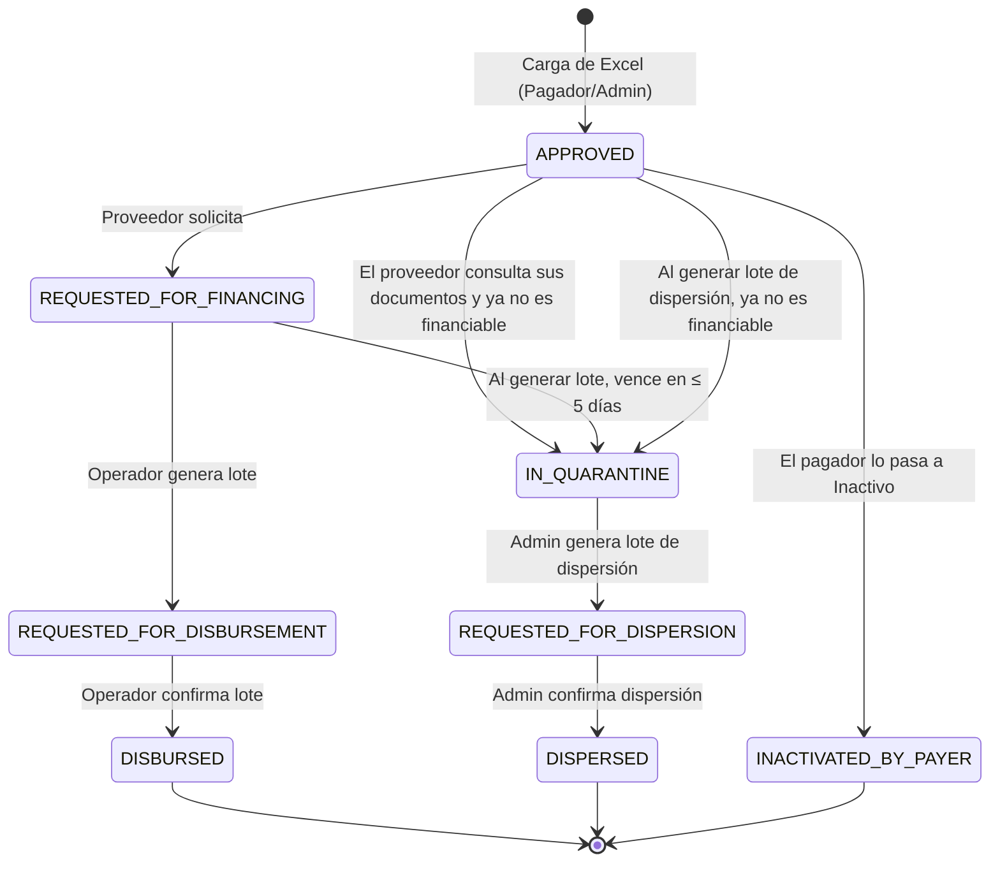

# Manual de usuario — Financiamiento de Cuentas por Pagar

**Banco Davivienda Salvadoreño · Banca Empresas**

Este manual describe el funcionamiento completo de la plataforma de Financiamiento de Cuentas por Pagar: quién participa, qué puede hacer cada rol, cómo se mueve un documento desde que se carga hasta que se desembolsa, y todas las reglas de negocio que el sistema aplica automáticamente.

---

## Contenido

1. [Introducción](#1-introducción)
2. [Glosario](#2-glosario)
3. [Acceso a la plataforma](#3-acceso-a-la-plataforma)
4. [Ciclo de vida de un documento](#4-ciclo-de-vida-de-un-documento)
5. [Reglas de negocio clave](#5-reglas-de-negocio-clave)
6. [Guía del Administrador](#6-guía-del-administrador)
7. [Guía del Pagador](#7-guía-del-pagador)
8. [Guía del Proveedor](#8-guía-del-proveedor)
9. [Guía del Operador](#9-guía-del-operador)
10. [Configuración del sistema](#10-configuración-del-sistema)
11. [Correos automáticos](#11-correos-automáticos)
12. [Casos prácticos y preguntas frecuentes](#12-casos-prácticos-y-preguntas-frecuentes)
13. [Mensajes frecuentes y cómo resolverlos](#13-mensajes-frecuentes-y-cómo-resolverlos)
- [Anexo A — Estado actual de funcionalidades (equipo técnico)](#anexo-a--estado-actual-de-funcionalidades-equipo-técnico)

---

## 1. Introducción

La plataforma permite que un **Pagador** (empresa cliente del banco) registre las facturas que debe a sus **Proveedores**. Cada proveedor puede solicitar que el banco le **anticipe el pago** de esas facturas antes de su vencimiento, a cambio de intereses y una comisión. El **Operador** del banco agrupa las solicitudes en lotes, ejecuta los desembolsos y gestiona los documentos que ya no pueden financiarse.

### Participantes

| Rol | Quién es | Qué hace en la plataforma |
|---|---|---|
| Administrador (operador bancario) | Personal del banco | Carga documentos en nombre de un pagador; administra convenios, usuarios y cupos de crédito; genera y confirma lotes de desembolso, ejecuta cortes de cuarentena y notifica a los clientes. |
| Administrador del sistema | Personal del banco | Administra los parámetros del sistema. |
| Pagador | Empresa cliente del banco | Carga el archivo Excel con las facturas de sus proveedores y consulta su bitácora. |
| Proveedor | Empresa que vende al pagador | Consulta sus facturas financiables, simula el costo y solicita el anticipo. |

En este manual, **operador** se refiere al Administrador cuando trabaja en las terminales de desembolso, dispersión y cuarentena.

### Flujo general



---

## 2. Glosario

| Término | Significado |
|---|---|
| **Documento** | Factura (CCF o FCI) registrada en la plataforma, digital (DTE) o en papel. |
| **Convenio marco** | Acuerdo entre un pagador y un proveedor. Define la política de pago y la política de desembolso. |
| **Política de pago** | Plazo en días que el pagador tiene para pagar la factura. Determina la fecha de vencimiento: *vencimiento = fecha de emisión + días de la política*. |
| **Política de desembolso** | Regla que define **qué día** el banco desembolsa el anticipo (por ejemplo, T+1 o "solo viernes"). |
| **Fecha de desembolso programada** | Día en que el banco debe desembolsar un documento solicitado. Se calcula al momento de la solicitud. |
| **Hora de corte** | Hora límite del día para que una solicitud se considere recibida ese mismo día (por defecto 15:00). |
| **Día hábil** | Lunes a viernes que no sea feriado registrado. |
| **Período de gracia (usura)** | Los 5 días previos al vencimiento. Un documento que vence dentro de ese margen respecto a su fecha de desembolso **no puede financiarse** por riesgo de infringir la ley de usura. |
| **Línea de crédito (cupo)** | Monto máximo que el banco autoriza al pagador para el programa. |
| **Lote de desembolso** | Agrupación de documentos solicitados que el operador procesa en conjunto. Código `DSB-AAAAMMDD-XXXXXX`. |
| **Cuarentena** | Estado de un documento que ya no será financiado. Requiere notificar al cliente. |
| **Corte de cuarentena** | Proceso del operador que consolida los documentos en cuarentena y genera el reporte oficial. Código `QUA-AAAAMMDD-XXXXXX`. |
| **Lote de carga** | Registro de cada archivo Excel procesado. Código `UPL-AAAAMMDD-XXXXXX`. |
| **Solicitud de financiamiento** | Pedido del proveedor sobre uno o más documentos. Código `REQ-XXXXXXXX`. |

---

## 3. Acceso a la plataforma

### 3.1 Inicio de sesión

1. Ingrese su **DUI** (9 dígitos, sin guion) y su contraseña.
2. Presione **"Iniciar sesión"**.
3. El sistema lo lleva a la pantalla inicial de su rol:
   - Administrador → Menú de administración.
   - Administrador del sistema → Gestión de parámetros.
   - Pagador → Carga de archivos.
   - Proveedor → Selección de convenio.

**Reglas**

- El usuario debe estar registrado y **activo**. Si no existe: *"Usuario no registrado en el sistema local."*
- La sesión dura **24 horas** (parámetro `JWT_EXPIRATION_MINUTES`). Al expirar, deberá ingresar de nuevo.

### 3.2 Barra superior

| Botón | Disponible para | Acción |
|---|---|---|
| **INICIO** | Todos | Regresa a la pantalla inicial del rol. |
| **BITACORA** | Administrador, Pagador, Proveedor | Historial de documentos. El Administrador consulta la de cada pagador (ver [6.8](#68-bitácora-de-documentos)). |
| **CUARENTENA** | Administrador | Corte de cuarentena y notificaciones a clientes. |

### 3.3 Tarjeta de usuario y cierre de sesión

Al pasar el cursor sobre su nombre (esquina superior derecha) se muestra una tarjeta con:

- Iniciales y nombre completo.
- Rol (Administrador, Administrador del sistema, Pagador o Proveedor).
- Empresa, correo y DUI.
- Botón **"Cerrar Sesión"**.

---

## 4. Ciclo de vida de un documento

### 4.1 Estados

| Estado (sistema) | Se muestra como | Significado |
|---|---|---|
| `APPROVED` | Cargado | Cargado por el pagador. Disponible para que el proveedor lo solicite (si cumple la regla de financiabilidad). |
| `REQUESTED_FOR_FINANCING` | Solicitado | El proveedor solicitó el anticipo. Espera su fecha de desembolso. |
| `REQUESTED_FOR_DISBURSEMENT` | En proceso | Incluido en un lote de desembolso generado por el operador. |
| `DISBURSED` | Desembolsado | El operador confirmó el desembolso. Estado final. |
| `IN_QUARANTINE` | No financiable | El sistema lo retiró porque venció o vence dentro de los días de gracia sin haberse solicitado. Estado final. |
| `INACTIVATED_BY_PAYER` | Inactivo | El pagador lo pasó manualmente a Inactivo, sea financiable o no. Estado final. |
| `REQUESTED_FOR_DISPERSION` | En dispersión | El administrador lo incluyó en un lote de dispersión: el banco cargará la cuenta del pagador y abonará al proveedor en la fecha de dispersión. |
| `DISPERSED` | Dispersado | El administrador confirmó la dispersión del lote. Estado final. |

### 4.2 Transiciones



**Reglas**

- **Cargar el archivo equivale a aprobar los documentos.** No existe un paso de aprobación posterior: al procesarse la carga, los documentos quedan en estado *Cargado*.
- Las transiciones no tienen reversa. Un documento desembolsado o en cuarentena no vuelve a estar disponible para el proveedor; los que están en cuarentena solo avanzan a dispersión (ver [9.7](#97-terminal-de-dispersiones)).
- Los inactivados por el pagador nunca se dispersan.
- Cada cambio de estado queda registrado en la bitácora del documento con el usuario, la fecha y, cuando aplica, la versión de términos y condiciones aceptada.

---

## 5. Reglas de negocio clave

### 5.1 Fecha de vencimiento

```
Fecha de vencimiento = Fecha de emisión + días de la política de pago del convenio
```

La calcula el sistema al cargar el documento.

### 5.2 Hora de corte

- Si la solicitud se hace **antes** de la hora de corte (por defecto **15:00**, hora de El Salvador), se considera recibida **hoy**.
- Si se hace **a la hora de corte o después**, se considera recibida **mañana**.
- La hora de corte es configurable (ver [sección 10](#10-configuración-del-sistema)).

### 5.3 Fecha de desembolso

La fecha de desembolso depende de la **política de desembolso** del convenio. El cálculo es:

1. Se aplica la hora de corte para obtener el día de recepción.
2. Si ese día no es hábil (sábado, domingo o feriado), se avanza al siguiente día hábil. Ese día es **"T"**.
3. Se suman los **días de desfase** (`offsetDays`) contando solo días hábiles.
4. Según el tipo de política:
   - **T+N**: la fecha obtenida es la fecha de desembolso.
   - **Días de la semana**: se toma el primer día permitido (por ejemplo, viernes) que no sea feriado, a partir de la fecha obtenida.

#### Tipos de política

| Tipo | Configuración | Significado |
|---|---|---|
| **T+N** | `offsetDays = N` | Desembolso N días hábiles después de la recepción. T+0 = mismo día. |
| **Días de la semana** | `weekdays` + `offsetDays` | Desembolso en el primer día permitido que caiga al menos `offsetDays` días hábiles después de la recepción. |

#### Políticas vigentes

| Código | Nombre | Tipo | Días | Desfase |
|---|---|---|---|---|
| `T_PLUS_1` | T+1 | T+N | — | 1 |
| `ONLY_FRIDAYS` | Solo viernes | Días de la semana | Viernes | 1 |

#### Ejemplos (sin feriados, solicitud antes del corte)

| Política | Solicitud | Desembolso |
|---|---|---|
| T+1 | Lunes | Martes |
| T+1 | Jueves | Viernes |
| T+1 | Viernes | Lunes |
| T+1 | Viernes después del corte | Martes (se recibe el lunes; T+1 = martes) |
| T+2 | Jueves | Lunes |
| T+2 | Jueves, con viernes feriado | Martes |
| Solo viernes (desfase 1) | Jueves | Viernes de esa semana |
| Solo viernes (desfase 1) | Viernes | Viernes de la semana siguiente |
| Solo viernes (desfase 0) | Viernes | Ese mismo viernes |
| Solo viernes (desfase 1) | Jueves, con viernes feriado | Viernes de la semana siguiente |
| Lunes y jueves (desfase 1) | Lunes | Jueves |
| Lunes y jueves (desfase 1) | Jueves | Lunes siguiente |

> **Feriados en políticas de días fijos:** si el día permitido es feriado, el desembolso pasa al **siguiente día permitido**, no al siguiente día hábil. Con "solo viernes", un viernes feriado mueve el desembolso al viernes siguiente.

### 5.4 Regla de financiabilidad (usura)

Esta es la regla más importante del sistema y se aplica **igual para el proveedor y para el operador**:

> **Un documento es financiable solo si vence más de 5 días después de su fecha de desembolso.**

```
Financiable  ⇔  Fecha de vencimiento > Fecha de desembolso + 5 días
```

Consecuencias:

| Quién | Qué ocurre si el documento **no** cumple |
|---|---|
| Proveedor | El documento **no aparece** en su lista de documentos financiables. Si intenta solicitarlo (por ejemplo, porque pasó la hora de corte mientras tenía la pantalla abierta), la solicitud se rechaza indicando qué documentos no cumplen. |
| Operador | El documento aparece **de inmediato** en *Pendientes de corte* y en *Clientes pendientes de notificar*, para que informe al cliente y lo incluya en el próximo corte de cuarentena. |

**Ejemplo con política "solo viernes"**: hoy es viernes 2 de octubre y el próximo desembolso es el viernes 9.

| Vence | ¿Financiable? | Motivo |
|---|---|---|
| 8 de octubre | No | Vence antes del desembolso. |
| 12 de octubre | No | El límite es el 14 (9 + 5); vence antes. |
| 14 de octubre | No | Vence exactamente en el límite. |
| 15 de octubre | **Sí** | Vence después del límite. |

**Red de seguridad al generar el lote:** cuando el operador genera un lote, el desembolso ocurre ese mismo día. Si un documento **ya solicitado** vence en 5 días o menos contando desde hoy (por ejemplo, porque el lote se generó con atraso), el sistema lo envía automáticamente a cuarentena con el motivo *"Solicitado, próximo a vencer"* y no lo incluye en el lote.

### 5.5 Cálculo financiero

El sistema calcula el costo del anticipo **por documento**, usando las condiciones del producto asignadas a la línea de crédito del pagador.

| Variable | Descripción |
|---|---|
| Tasa de interés | Tasa anual del producto (por ejemplo, 15 %). |
| Base de cálculo | 360 días (comercial) o 365 días (calendario). |
| Tasa de comisión | Porcentaje sobre el monto nominal (por ejemplo, 1 %). |
| IVA | Parámetro `IVA_RATE` (por defecto 13 %). Se aplica sobre la comisión. |
| Días financiados | Días calendario desde la fecha de desembolso hasta la fecha de vencimiento, contando ambos días (incluye sábados, domingos y feriados). Ejemplo: desembolso viernes 9 y vencimiento lunes 19 = 11 días. |

**Fórmulas**

```
Factor de descuento   = 1 / (1 + (tasa de interés / base) × días financiados)
Monto a financiar     = Monto nominal × Factor de descuento
Intereses             = Monto nominal − Monto a financiar
Comisión              = Monto nominal × tasa de comisión
IVA de la comisión    = Comisión × IVA
Monto a desembolsar   = Monto nominal − Intereses − (Comisión + IVA)
```

**Ejemplo**: factura de $10,000.00, tasa 15 % anual, base 360, 30 días financiados, comisión 1 %, IVA 13 %.

| Concepto | Cálculo | Resultado |
|---|---|---|
| Factor de descuento | 1 / (1 + 0.15/360 × 30) | 0.987654 |
| Monto a financiar | 10,000 × 0.987654 | $9,876.54 |
| Intereses | 10,000 − 9,876.54 | $123.46 |
| Comisión | 10,000 × 1 % | $100.00 |
| IVA | 100 × 13 % | $13.00 |
| **Monto a desembolsar** | 10,000 − 123.46 − 113.00 | **$9,763.54** |

> El cálculo se hace con la fecha de desembolso vigente **en el momento de la solicitud**. Si el lote se genera después de esa fecha, los montos **no se recalculan** automáticamente (ver [sección 9.3](#93-documentos-atrasados)).

### 5.6 Línea de crédito del pagador

- Cada pagador tiene una línea de crédito con: **cupo total**, **consumo actual** y **disponible** (*cupo total − consumo*).
- **El cupo se consume al cargar el archivo Excel**, por el total de los montos nominales del archivo.
- Si la carga supera el disponible, **se rechaza completa** y se descarga un reporte PDF de rechazo por límite de crédito, con el mismo formato del reporte de rechazo e indicando el total del archivo y el cupo disponible.
- **El cupo se libera únicamente cuando un administrador registra un abono** (pago parcial o liquidación total). No se libera automáticamente al desembolsar, al vencer ni al pasar a cuarentena.

### 5.7 Términos y condiciones

- **Pagador / Administrador**: debe aceptar los términos del pagador antes de procesar cada carga.
- **Proveedor**: debe aceptar los términos del proveedor antes de enviar cada solicitud. La cláusula 7 muestra la tasa de interés y comisión aplicables.
- Se usa siempre la **versión activa más reciente** de cada tipo de términos.
- Cada aceptación queda auditada (usuario, versión aceptada, navegador utilizado) y vinculada a los documentos procesados.

---

## 6. Guía del Administrador

### 6.1 Menú principal

| Opción | Para qué sirve |
|---|---|
| Carga de documentos | Cargar el Excel de facturas en nombre de un pagador. |
| Gestión de convenios comerciales | Consultar y modificar convenios marco. |
| Gestión de usuarios | Registrar y consultar usuarios. |
| Gestión de cupos de crédito | Consultar líneas de crédito y registrar abonos. |
| Terminal de dispersiones | Generar y confirmar los lotes de dispersión de los documentos que el proveedor no anticipó (ver [9.7](#97-terminal-de-dispersiones)). |
| Bitácora de dispersiones | Consultar los lotes de dispersión, su estado, quién los generó y confirmó, y volver a descargar la solicitud. |
| Recursos de carga | Publicar la plantilla de Excel y el manual que se ofrecen en la carga de documentos (ver [6.9](#69-recursos-de-carga)). |

### 6.2 Carga de documentos

1. En **"Directorio de Pagadores"**, busque y seleccione el pagador (por nombre, NIT o código). Sus datos aparecen en *"Detalles del Pagador"*.
2. Si aún no tiene el archivo, use la sección **"Recursos"**: cada **"Descargar"** baja la plantilla de Excel vigente o el manual en PDF que explica cómo llenarla. Si el administrador no los ha publicado, aparecen como *"No disponible"*.
3. Presione **"Seleccionar archivo"** y elija el Excel (formato `.xlsx`).
4. Presione **"Ver términos y condiciones"**, lea el texto, marque la casilla de aceptación y presione **"Confirmar solicitud"**.
5. Presione **"Procesar archivo"**.
6. Resultado:
   - **Carga exitosa**: se descarga el comprobante `Comprobante_Exito_<archivo>.pdf` con la lista de documentos registrados.
   - **Carga rechazada**: se descarga `Reporte_Errores_<archivo>.pdf` con quién hizo la carga y cada inconsistencia (correlativo, fila, columna, tipo de error y detalle). **No se registra ningún documento** del archivo; corrija y vuelva a cargar el archivo completo.

Las reglas del archivo se detallan en la [sección 6.3](#63-reglas-del-archivo-excel).

### 6.3 Reglas del archivo Excel

**Estructura**

- Solo se lee la **primera hoja**.
- La **fila 1** contiene los encabezados (no distingue mayúsculas ni espacios al inicio o final).
- Las filas vacías se ignoran.
- Si falta una columna obligatoria, se rechaza el archivo completo.
- Las celdas de **monto** deben tener formato *Número* o *Contabilidad* (no texto).
- Las celdas de **fecha** deben tener formato *Fecha* (no texto).

**Validaciones por campo**

| Campo | Regla |
|---|---|
| Forma de emisión | Obligatorio. `DIGITAL` o `PAPER`. |
| Tipo de documento | Obligatorio. Exactamente `CCF` o `FCI`. |
| Fecha de emisión | Obligatoria. No puede ser futura ni tener más de **120 días** de antigüedad (parámetro `MAX_INVOICE_AGE_DAYS`). |
| Monto | Mayor a cero, con máximo 2 decimales. El sistema no redondea: un monto con más decimales se rechaza. |
| NIT del proveedor | Obligatorio, 14 dígitos (se aceptan guiones). Identifica al proveedor: si el NIT ya pertenece a un pagador o al banco, el archivo se rechaza. |
| Nombre del proveedor | Obligatorio, máximo 255 caracteres. |
| Política de pago | Obligatoria. Debe ser un código existente en el catálogo (por ejemplo `P30`, `P45`, `P60`, `P90`). |
| Día de desembolso | Obligatorio. Debe ser un código de política de desembolso existente (por ejemplo `T_PLUS_1`, `ONLY_FRIDAYS`). |

> El archivo ya no lleva NIU del proveedor (el sistema ya no usa NIU) ni datos del operario. Si un archivo anterior trae esas columnas, se ignoran.

**Documentos digitales (DTE, forma de emisión `DIGITAL`)**

| Campo | Regla |
|---|---|
| Código de generación | Obligatorio. Formato UUID de 36 caracteres. |
| Sello de recepción | Obligatorio. Exactamente 40 caracteres. |
| Número de control | Obligatorio. Formato `DTE-TT-XXXXXXXX-NNNNNNNNNNNNNNN`: `TT` es 01 (FCI) o 03 (CCF) y debe coincidir con el tipo de documento. |

**Documentos en papel (forma de emisión `PAPER`)**

| Campo | Regla |
|---|---|
| Número de documento | Obligatorio, máximo 255 caracteres. |
| Código de generación, sello y número de control | Deben ir **vacíos**. |

**Control de doble financiamiento**

- **DTE**: el código de generación, el número de control y el sello de recepción no pueden existir ya en la plataforma ni repetirse dentro del archivo.
- **Papel**: el número de documento no puede repetirse para el mismo proveedor (NIT) en el mismo año de emisión, ni dentro del archivo.

**Límite de crédito**

- El total del archivo no puede superar el disponible de la línea de crédito del pagador. Si lo supera, el archivo completo se rechaza.

**Creación automática**

Al procesar un archivo válido, el sistema crea automáticamente lo que no exista:

- **Proveedor** nuevo (identificado por su NIT), con su cuenta bancaria principal.
- **Convenio marco** entre el pagador y el proveedor, con la política de pago y de desembolso indicadas en el archivo.

> Si el convenio ya existe, se mantienen sus políticas actuales; las columnas de política del archivo solo se usan al crear un convenio nuevo.

La carga **no crea usuarios**. Para que el proveedor pueda ingresar y solicitar anticipos, el administrador le da de alta uno o varios usuarios en *Gestión de usuarios* ([sección 6.5](#65-usuarios)). Los documentos se pueden cargar aunque el proveedor todavía no tenga usuarios.

### 6.4 Convenios marco

- Se consulta por pagador: a la izquierda está el **directorio de pagadores** (búsqueda por nombre, NIT o código) y al entrar se selecciona el primero.
- La tabla muestra los convenios del pagador seleccionado: proveedor, política de pago, política de desembolso, tipo de convenio y estado. El buscador filtra por nombre del proveedor.
- Con **"Modificar"** solo se pueden cambiar la política de pago y la política de desembolso. Estado, tipo, pagador y proveedor quedan bloqueados.
- Un pagador y un proveedor solo pueden tener un convenio del mismo tipo.

> Cambiar la política de desembolso afecta a las **solicitudes futuras**. Las solicitudes ya enviadas conservan su fecha de desembolso programada.

### 6.5 Usuarios

- Lista de usuarios con DUI, nombre, correo, entidad y rol.
- **"Registrar usuario"** permite crear un usuario indicando nombre, correo, DUI (9 dígitos), rol y entidad. El DUI y el correo deben ser únicos.
- Primero se elige el **rol**; el selector de **entidad** muestra solo las entidades del tipo que corresponde y permite buscarlas por nombre o NIT:

| Rol | Entidad |
|---|---|
| ADMIN | Banco |
| PAYER | Pagador |
| SUPPLIER | Proveedor |

- Desde esta pantalla solo se asignan los roles ADMIN, PAYER y SUPPLIER. El rol SYSTEM_ADMIN (administrador del sistema) solo se asigna en la base de datos, y sus usuarios no se pueden modificar aquí.
- El primer ADMIN y el administrador del sistema de producción los crea el DBA con el script `db/prod/instalacion_inicial.sql`, junto con la base de datos y la entidad banco.
- Al cambiar el rol se borra la entidad elegida y hay que seleccionarla de nuevo.
- Un proveedor puede tener varios usuarios. Así se dan de alta los usuarios de los proveedores creados desde la carga de documentos.

### 6.6 Cupos de crédito

1. Seleccione el cliente (pagador).
2. Consulte: cupo total autorizado, consumo actual, cupo neto disponible y porcentaje de ocupación.
3. Para liberar cupo, presione **"Registrar abono"**:
   - **Tipo**: *Pago parcial* o *Liquidación total* (esta última llena el monto con el consumo actual).
   - **Monto**: mayor a 0 y no mayor al consumo actual.
   - **Referencia / comprobante de pago**: obligatoria.
   - Presione **"Aplicar y restaurar cupo"**.
4. El abono queda en el **"Historial de redenciones al cupo"** con referencia, fecha, operador y monto.

### 6.7 Parámetros

Los parámetros del sistema (ver [sección 10.1](#101-parámetros)) no los administra el Administrador sino el rol **Administrador del sistema**, cuya única pantalla es la gestión de parámetros.

### 6.8 Bitácora de documentos

Desde **BITACORA** (barra superior, a la derecha de **INICIO**), el administrador consulta la bitácora de cualquier pagador. Es la misma que ve el pagador ([sección 7.2](#72-bitácora)), en modo de solo lectura:

- **Directorio de pagadores** (izquierda): búsqueda por nombre, NIT o código. Al entrar se selecciona el primero.
- **Tarjeta del pagador seleccionado** (arriba): datos de la entidad y estado de su línea de crédito.
- **Panel de proveedores, filtro por estado y tabla** de documentos, incluida la columna *Cargado por*.

El administrador no puede pasar documentos a Inactivo: esa acción es exclusiva del pagador, por lo que la tabla no tiene columna *Acciones*.

### 6.9 Recursos de carga

Define lo que ven el administrador y el pagador en la sección **"Recursos"** de la carga de documentos. Hay una sola plantilla y un solo manual vigentes; al publicar uno nuevo se reemplaza el anterior.

**Plantilla de carga**

1. Presione **"Seleccionar archivo"** y elija el Excel.
2. Presione **"Publicar plantilla"** (si ya hay una, confirme el reemplazo).

La plantilla se rechaza si:

- No es un archivo `.xlsx`, supera 1 MB o contiene macros.
- La primera fila de la primera hoja no tiene exactamente las columnas que acepta la carga. El mensaje indica las columnas que faltan, las que no se reconocen y las repetidas.

Con **"Descargar vigente"** se baja la plantilla publicada. En producción, la plantilla inicial está en `db/prod/plantilla_carga_documentos.xlsx` y se publica en el primer ingreso.

**Manual de uso de la plantilla**

1. Presione **"Seleccionar archivo"** y elija el PDF.
2. Presione **"Publicar manual"** (si ya hay uno, confirme el reemplazo).

El manual se rechaza si no es un archivo `.pdf`, supera 10 MB, está protegido con contraseña o cifrado, o contiene JavaScript, acciones que ejecutan programas o envían datos, o archivos incrustados.

Con **"Descargar vigente"** se baja el manual publicado. En producción, el manual inicial está en `db/prod/manual_carga_documentos.pdf` y se publica en el primer ingreso. Si cambian las columnas o las reglas de la carga, actualice la plantilla y el manual.

---

## 7. Guía del Pagador

### 7.1 Carga de archivos

La única función operativa del pagador es cargar documentos. El pagador no aprueba documentos: toda factura cargada correctamente queda aprobada de inmediato.

La pantalla y las reglas son las mismas que usa el administrador ([secciones 6.2](#62-carga-de-documentos) y [6.3](#63-reglas-del-archivo-excel)), incluida la sección **"Recursos"** con la plantilla de Excel y el manual de uso. La diferencia es que no hay directorio de pagadores: la carga se hace siempre a nombre del pagador del usuario.

A la izquierda se muestra la **tarjeta del pagador**:

- **Datos de la entidad**: nombre, NIT y código.
- **Estado de la línea**: cupo total, consumo actual, disponible y porcentaje de ocupación, con la marca del umbral de carga.
- **Disponible para cargar**: lo que aún puede cargarse sin superar el tope de carga (cupo × umbral de alerta). Es el mismo cálculo que usa la validación del archivo; si el archivo totaliza más, la carga se rechaza por límite de crédito.

Cuando el disponible para cargar llega a cero, se muestra el aviso *"Límite de crédito excedido"* y no se puede seleccionar archivo. La tarjeta se actualiza después de cada carga exitosa.

Al completarse la carga, las facturas quedan **disponibles para que sus proveedores soliciten el anticipo**.

### 7.2 Bitácora

La **Bitácora** muestra el estado de todos los documentos cargados por el pagador, organizados por proveedor.

- **Tarjeta del pagador** (arriba): los mismos datos de la entidad y de la línea que en la carga de archivos. Se actualiza al inactivar un documento, porque su monto se libera del cupo.
- **Panel de proveedores**: lista cada proveedor con su NIT, cantidad de documentos, monto total y un desglose por estado (por ejemplo *Cargado: 4 · Desembolsado: 2*). Se puede buscar por nombre o NIT. La primera tarjeta, *"Todos los proveedores"*, muestra el total general.
- **Al seleccionar un proveedor**, la tabla muestra solo sus documentos. *"Ver todos"* quita el filtro.
- **Filtro por estado** (menú desplegable): Todos, Cargado, Solicitado, En proceso, Desembolsado, No financiable, Inactivo, En dispersión y Dispersado, cada uno con su conteo.
- **Tabla**: número de documento, proveedor, fecha de emisión, vencimiento, desembolso, monto, usuario que hizo la carga (*Cargado por*) y estado.

---

## 8. Guía del Proveedor

### 8.1 Selección de convenio

1. Al ingresar se muestra **"Bienvenido/a"** y la lista de convenios (órdenes de pago) con sus pagadores.
2. Seleccione el convenio y presione **"Continuar"**.

### 8.2 Solicitar financiamiento

La pantalla muestra:

- **Fecha de desembolso**: la próxima fecha en que el banco desembolsaría si solicita ahora (según la política del convenio y la hora de corte).
- **Cuenta de abono**: la cuenta principal del proveedor, donde se acreditará el desembolso. Si no tiene una registrada, se muestra *"Sin cuenta registrada"* con un aviso, y los botones **"Ver detalles"** y **"Solicitar desembolso"** quedan deshabilitados hasta que el banco la registre. El servidor también rechaza la solicitud si el proveedor no tiene cuenta principal.
- **Datos del convenio**: pagador, documentos disponibles, política de pago y día de desembolso.

**Paso 1 — Seleccionar documentos**

1. La tabla muestra los documentos **financiables**: número, fecha de emisión, fecha de vencimiento y monto.
2. Marque los documentos que desea anticipar.
3. El resumen se recalcula con cada cambio: monto total, comisión (con IVA), intereses y monto a abonar.
4. Presione **"Ver detalles"**.

**Paso 2 — Revisar**

1. Revise por documento: fechas, días de financiamiento, monto, intereses y comisión.
2. Presione **"Solicitar desembolso"**.
3. Lea los términos y condiciones, marque la casilla de aceptación y presione **"Confirmar solicitud"**.
4. Mensaje final: *"La solicitud de desembolso se ha efectuado correctamente"*.
5. Los operadores bancarios reciben un correo con el aviso de la nueva solicitud ([11.1](#111-aviso-de-nueva-solicitud-de-anticipo)).

**Reglas**

- Solo se muestran los documentos que cumplen la [regla de financiabilidad](#54-regla-de-financiabilidad-usura): vencen más de 5 días después de la próxima fecha de desembolso. Los demás **no aparecen**.
- Si mientras tiene la pantalla abierta un documento deja de ser financiable (por ejemplo, pasó la hora de corte y la fecha de desembolso avanzó), el sistema muestra **"Documentos no disponibles"** con el detalle y actualiza la lista.
- Un documento solo puede solicitarse una vez.
- Los montos mostrados son los que se registrarán: el cálculo se realiza con la fecha de desembolso vigente al momento de la solicitud.

### 8.3 Bitácora del proveedor

Desde **BITACORA** se consulta el historial de documentos con: número, fecha de emisión, fecha de desembolso, monto, monto abonado (lo acreditado en su cuenta, ya descontados intereses y comisión; solo en documentos desembolsados), pagador y estado. Se puede filtrar por estado:

| Filtro | Estado |
|---|---|
| Cargado | Disponible o pendiente de solicitar. |
| Solicitado | Solicitud enviada; espera su fecha de desembolso. |
| En proceso | Incluido en un lote del banco. |
| Desembolsado | Pagado por el banco. |
| No financiable | El sistema lo retiró por vencido o próximo a vencer; no será financiado. |
| Inactivo | El pagador lo inactivó manualmente; no será financiado. |

Los documentos no financiables, inactivos, en dispersión o dispersados no se muestran al proveedor en su bitácora.

---

## 9. Guía del Operador

Estas pantallas las usa el usuario con rol Administrador (operador bancario).

Cada vez que un proveedor envía una solicitud de financiamiento, el operador recibe un correo con el detalle ([11.1](#111-aviso-de-nueva-solicitud-de-anticipo)). Los documentos de esa solicitud aparecen en la terminal de desembolsos en su fecha de desembolso programada.

### 9.1 Terminal de desembolsos

**Aviso de notificaciones**: en la parte superior aparece *"N cliente(s) por notificar"* cuando hay documentos que no serán financiados. Al presionarlo lleva a la sección de notificaciones.

**Resumen por pagador**

1. Seleccione el pagador.
2. Se muestra:
   - Política de pago y línea de crédito disponible.
   - **Docs. listos**: documentos solicitados con fecha de desembolso **hoy o anterior**, que aún son financiables.
   - **Atrasados** (ámbar): documentos cuya fecha de desembolso ya pasó. Requieren ajuste manual (ver [9.3](#93-documentos-atrasados)).
   - **Próximos a vencer** (rojo): documentos solicitados que ya no son financiables. Pasarán a cuarentena al generar el lote.
   - **Programados para después**: documentos con fecha de desembolso futura y la próxima fecha.

### 9.2 Generar lote de desembolso

1. Presione **"Generar batch"** y confirme con **"Sí, generar lote"**.
2. El sistema:
   1. Envía a cuarentena los documentos solicitados que vencen en **5 días o menos** desde hoy (motivo *"Solicitado, próximo a vencer"*).
   2. Incluye en el lote todos los documentos con fecha de desembolso **hoy o anterior** que sigan siendo financiables.
   3. Cambia esos documentos a *En proceso*.
   4. Descarga un ZIP con los reportes PDF del lote.
3. Si hubo documentos enviados a cuarentena, se muestra el recordatorio **"Notifique a los clientes"**.
4. Si no hay documentos listos: *"El pagador no tiene documentos con fecha de desembolso programada para hoy o antes."*

**Reportes PDF del lote**

- **Un PDF por grupo** de documentos con la misma fecha de vencimiento y fecha de solicitud. Título: *"Desembolso Lote: … - Plazo: N días"*. Incluye: dueño de la línea de crédito, monto total a desembolsar, comisión con IVA, número de cupo, fecha de desembolso y plazo; y por documento: número, monto nominal, interés, comisión y monto a desembolsar.
- **Un PDF adicional de documentos atrasados** (si los hay), titulado *"Documentos atrasados – requieren ajuste manual"*, con la fecha programada, los días de atraso y el vencimiento de cada documento.

Los reportes pueden volver a descargarse desde el histórico con **"Re-descargar reportes"**.

### 9.3 Documentos atrasados

Un documento está **atrasado** cuando su fecha de desembolso programada es **anterior** a la fecha del lote (por ejemplo, el lote no se generó el día que correspondía).

- Sus montos (intereses y monto a desembolsar) **se calcularon para la fecha original** y **no se recalculan** en el sistema.
- El ajuste de montos se gestiona **fuera del sistema**, de forma manual.
- El sistema los identifica con la etiqueta *"Atrasado N día(s)"*, los separa en su propio PDF y exige una observación al confirmar.

### 9.4 Confirmar desembolso

1. En **"Histórico de batch generados"**, presione **"Confirmar pago"** en el lote.
2. Revise el detalle: documento, proveedor, fecha programada y monto a desembolsar.
3. Si el lote tiene documentos atrasados:
   - Marque la casilla *"Revisé los documentos atrasados y sus ajustes manuales fueron gestionados fuera del sistema."*
   - Escriba la **observación de ajustes manuales** (obligatoria, hasta 1,000 caracteres).
4. Presione **"Confirmar lote completo"** y confirme con **"Sí, confirmar"**.

**Reglas**

- La confirmación aplica al **lote completo**. No existe confirmación parcial ni devolución de documentos al proveedor.
- Un lote solo puede confirmarse una vez.
- Al confirmar, todos los documentos pasan a *Desembolsado* y el lote a *Liquidado*.
- **La acción no se puede deshacer.**

### 9.5 Corte de cuarentena

La pantalla **CUARENTENA** muestra en **"Pendientes de corte"**:

- Documentos ya marcados en cuarentena que aún no están en un corte.
- **Documentos no solicitados y no financiables**: documentos aprobados que ya no cumplen la regla de financiabilidad según la política de su convenio.
- Desglose por motivo y por pagador, con el monto total.

**Ejecutar el corte**

1. Presione **"Generar corte"** y confirme con **"Sí, generar corte"**.
2. El sistema:
   - Pasa a cuarentena los documentos aprobados no financiables, con el motivo correspondiente.
   - Crea el corte y descarga un ZIP con **un PDF por pagador** (documento, proveedor, emisión, vencimiento, monto, motivo y fecha de cuarentena).
3. Los cortes anteriores están en la pestaña **"Histórico de cortes"** y pueden volver a descargarse.

**Motivos de cuarentena**

| Motivo | Cuándo se asigna | Requiere notificar al cliente |
|---|---|---|
| Solicitado, próximo a vencer | El proveedor lo solicitó, pero al generar el lote vence en 5 días o menos. | Sí |
| No solicitado, próximo a vencer | No fue solicitado y ya no es financiable, aunque aún no vence. | Sí |
| Vencido sin solicitar | No fue solicitado y su fecha de vencimiento ya pasó. | Sí |
| Fallo de desembolso | Reservado para fallos del core bancario. | No |
| Revisión manual | Reservado para revisión manual. | No |

### 9.6 Notificación a clientes

La sección **"Clientes pendientes de notificar"** agrupa por proveedor todos los documentos que no serán financiados y cuyo cliente aún no ha sido informado.

1. Contacte al cliente por los canales del banco e infórmele qué documentos no serán financiados y el motivo.
2. Presione **"Marcar como notificado"** en el proveedor y confirme con **"Sí, ya fue notificado"**.
3. La notificación queda registrada con la fecha y el usuario que la realizó.

**Reglas**

- Un documento aparece en esta lista **en cuanto deja de ser financiable**, aunque todavía no se haya ejecutado el corte.
- Cada documento se notifica **una sola vez**.
- La plataforma no envía correos: la notificación la realiza el operador y el sistema solo registra que se hizo.

**Historial de notificaciones por pagador**

En la pestaña **"Notificaciones por pagador"** se consultan todas las notificaciones realizadas, agrupadas por pagador, con: documento, proveedor, motivo, vencimiento, monto, fecha de notificación y usuario. Se puede filtrar por pagador.

### 9.7 Terminal de dispersiones

Disponible solo para el administrador bancario, desde la tarjeta **"Terminal de dispersiones"** del menú. Sirve para que el banco pague al proveedor, con cargo a la cuenta del pagador, las facturas que el proveedor no anticipó.

**Documentos que se dispersan**

- Los documentos **No financiables** (en cuarentena), sea cual sea su motivo.
- Los documentos **Cargados** que el proveedor ya no puede solicitar porque pasaron el umbral de financiabilidad de la política de su convenio (el proveedor nunca entró a solicitarlos).
- Nunca se dispersan los documentos **Inactivos** (los que inactivó el pagador).

**Pantalla**

1. Seleccione el pagador. El panel muestra su **cuenta de cargo** (la cuenta principal del pagador) y cuántos vencimientos tiene por dispersar.
2. La tabla **"Solicitudes de dispersión"** muestra una fila por **fecha de vencimiento** pendiente (estado *Generado*) y una por cada lote ya generado (*En proceso* o *Dispersado*), con proveedores, documentos y monto.

**Generar lote**

1. En una fila *Generado*, presione el ícono de descarga. Se abre el detalle con los documentos del vencimiento: una fila por proveedor con su cuenta a abonar, la cantidad de documentos (registros), la fecha de vencimiento y el monto total de sus facturas.
2. Presione **"Generar lote y descargar solicitud"** y confirme con **"Sí, generar"**.
3. El sistema:
   1. Pasa a *No financiable* los documentos que seguían *Cargados* (motivo *"No solicitado, próximo a vencer"* o *"Vencido sin solicitar"*) y libera su monto del cupo del pagador.
   2. Crea el lote `DSP-AAAAMMDD-XXXXXX` con todos los documentos de ese pagador y vencimiento, y los pasa a *En dispersión*.
   3. Descarga la **Solicitud de dispersión de pagos** en PDF.

**Reglas**

- Un lote agrupa los documentos de **un pagador** con **la misma fecha de vencimiento**.
- La **fecha de dispersión es la misma fecha de vencimiento** de los documentos. El administrador debe generar el lote el día que corresponde; el sistema no la valida contra días hábiles ni fechas pasadas.
- El pagador debe tener una **cuenta principal** registrada; si no la tiene, no se puede generar el lote.
- Si otro usuario ya generó el lote de ese vencimiento, el sistema avisa que el pagador ya no tiene documentos por dispersar con esa fecha.

**Solicitud de dispersión de pagos (PDF)**

- La firma el **usuario del pagador que cargó los documentos** del lote; si vienen de varias cargas, el de la carga más reciente. Se muestran su nombre y DUI.
- Va fechada con la fecha de vencimiento ("San Salvador, …").
- Indica la **cuenta del pagador** que se cargará y una tabla con una fila por proveedor: fecha de dispersión, nombre de la cuenta (proveedor), cuenta a abonar (cuenta principal del proveedor), registros (cantidad de documentos), fecha de vencimiento y monto total de sus facturas.
- Si un proveedor no tiene cuenta principal, la columna muestra *"Sin cuenta principal"*.
- Puede volver a descargarse desde la terminal o desde la bitácora de dispersiones.

**Confirmar dispersión**

1. En una fila *En proceso*, presione el ícono de doble check. Revise el detalle del lote.
2. Presione **"Confirmar dispersión"** y confirme con **"Sí, confirmar"**. Si la fecha de dispersión aún no llega, el sistema lo advierte.
3. Todos los documentos del lote pasan a *Dispersado* y el lote queda *Dispersado*. Un lote solo puede confirmarse una vez y **la acción no se puede deshacer**.

### 9.8 Bitácora de dispersiones

Desde la tarjeta **"Bitácora de dispersiones"** se consultan los lotes de dispersión generados, filtrables por pagador: número de lote, pagador, cuenta de cargo, fecha de dispersión, vencimiento, fecha de generación, documentos, monto, estado, quién lo generó y quién lo confirmó. El ícono de descarga vuelve a generar la solicitud en PDF.

---

## 10. Configuración del sistema

### 10.1 Parámetros

| Clave | Formato | Valor por defecto | Uso |
|---|---|---|---|
| `DISBURSEMENT_CUTOFF_TIME` | `HH:mm` | `15:00` | Hora de corte diaria para las solicitudes. |
| `IVA_RATE` | Decimal entre 0 y 1 (0.13 = 13 %) | `0.13` | IVA aplicado sobre la comisión. |
| `DUE_DATE_GRACE_DAYS` | Entero de 0 a 60 | `5` | Período de gracia (usura): días antes del vencimiento en los que un documento ya no se puede financiar. |
| `MAX_INVOICE_AGE_DAYS` | Entero de 1 a 3650 | `120` | Antigüedad máxima de una factura al cargarla. |
| `DEFAULT_CREDIT_THRESHOLD` | Decimal entre 0.01 y 1 (0.80 = 80 %) | `0.80` | Umbral que se usa cuando una línea de crédito no tiene uno propio: alerta del cupo y tope de la carga. |
| `UPLOAD_ALLOWED_EXTENSIONS` | Lista separada por comas (`.xlsx`, `.xls`) | `.xlsx,.xls` | Formatos de archivo aceptados en la carga. |
| `UPLOAD_MAX_FILE_SIZE_MB` | Entero de 1 a 50 | `5` | Tamaño máximo del archivo de carga, en MB. |
| `UPLOAD_MAX_ROWS` | Entero de 1 a 100000 | `5000` | Cantidad máxima de registros por archivo. |
| `CORS_ALLOWED_ORIGINS` | Lista de orígenes `https://dominio[:puerto]` separados por comas | `http://localhost:5173,https://devpay.davivienda.com.sv` | Direcciones desde las que el navegador puede usar la API. Debe incluir la URL del cliente del ambiente. |
| `JWT_EXPIRATION_MINUTES` | Entero de 5 a 10080 | `1440` | Duración de la sesión, en minutos. Aplica a los inicios de sesión posteriores al cambio. |
| `JWT_SECRET` | Base64 de al menos 32 bytes | `G9UuPSmEz8a18PARiE8Rs9QKvDrdUOJjjNe3duoQqUw=` | Llave con la que se firman las sesiones. Cada ambiente puede reemplazarla. Cambiarla invalida las sesiones ya emitidas. |

Al guardar, el sistema valida el formato y el rango; la clave no se puede modificar. Los cambios aplican en menos de un minuto, sin reiniciar. Si un valor guardado es inválido o la fila no existe, el sistema usa el valor por defecto.

> **Cuidado con `CORS_ALLOWED_ORIGINS`:** si se quita la URL del cliente, el navegador dejará de poder usar la aplicación en ese ambiente y habrá que corregir el valor directamente en la base de datos.

### 10.2 Valores fijos del sistema

| Regla | Valor |
|---|---|
| Zona horaria de negocio | America/El_Salvador |
| Observación de documentos atrasados | Máximo 1,000 caracteres |

### 10.3 Configuración por ambiente

| Componente | Variable | Descripción |
|---|---|---|
| Backend | Parámetro `JWT_SECRET` | Llave de firma de las sesiones (sección 10.1). Vive en `system_parameters`, no en una variable de entorno. El valor inicial permite arrancar; conviene reemplazarlo en cada ambiente. |
| Cliente | `VITE_API_BASE_URL` | URL base del backend, sin `/api`. |
| Cliente | `VITE_PORTAL_URL` | Portal del banco al que se redirige sin sesión o al salir. |

Las variables del cliente se toman al compilar, desde `.env.development` (`npm run dev`) o `.env.production` (`npm run build`). Hay una plantilla en `.env.example`.

### 10.4 Crear una nueva política de desembolso

Las políticas se definen por datos en el catálogo `disbursement_policies_cat`, sin cambios de código:

| Campo | Descripción |
|---|---|
| `code` | Código único. Es el valor que se usa en la columna *Día de desembolso* del Excel. |
| `name` / `description` | Texto visible. |
| `type` | `T_PLUS_N` o `WEEKDAYS`. |
| `weekdays` | Solo para `WEEKDAYS`. Días separados por coma: `MONDAY`, `TUESDAY`, `WEDNESDAY`, `THURSDAY`, `FRIDAY`. |
| `offset_days` | Días hábiles de desfase. Obligatorio para `T_PLUS_N`; opcional (0) para `WEEKDAYS`. |
| `status` | `ACTIVE` o `INACTIVE`. |

Ejemplos:

```sql
-- T+2
INSERT INTO disbursement_policies_cat (id, code, name, description, type, weekdays, offset_days, status, created_at, updated_at)
VALUES (gen_random_uuid(), 'T_PLUS_2', 'T+2', 'Desembolso dos días hábiles después', 'T_PLUS_N', NULL, 2, 'ACTIVE', NOW(), NOW());

-- Lunes y jueves, con al menos un día hábil de margen
INSERT INTO disbursement_policies_cat (id, code, name, description, type, weekdays, offset_days, status, created_at, updated_at)
VALUES (gen_random_uuid(), 'MON_THU', 'Lunes y jueves', 'Desembolso lunes y jueves', 'WEEKDAYS', 'MONDAY,THURSDAY', 1, 'ACTIVE', NOW(), NOW());
```

**Validaciones**: el sistema rechaza (al arrancar se registra un error, y en la carga de Excel se rechaza el archivo) políticas sin tipo, `T_PLUS_N` sin desfase, desfases negativos, `WEEKDAYS` sin días, con días inválidos o solo con sábado/domingo.

### 10.5 Feriados

- Los feriados se registran en el catálogo de feriados bancarios con fecha, descripción y estado.
- Solo los feriados **activos** afectan el cálculo de días hábiles.
- Registre los feriados con anticipación: un feriado agregado después de una solicitud no modifica las fechas de desembolso ya programadas.

---

## 11. Correos automáticos

La plataforma envía correos electrónicos automáticos cuando ocurren ciertos eventos. Cada destinatario recibe su propio correo, con un saludo a su nombre.

**Condiciones generales**

- Solo reciben correo los usuarios **activos** con correo registrado. El rol Administrador corresponde al operador bancario.
- El correo se envía **después** de que la operación quedó guardada. Si la operación falla, no se envía nada.
- Si el envío de correo no está configurado (parámetros de Mailjet en `CONFIGURAR`), la operación se realiza normalmente, pero no se envían correos.
- El botón **"Ingresar a la plataforma"** aparece solo si el parámetro `APP_LOGIN_URL` está configurado.
- Los montos se muestran con el formato `$1,500.00`, y las fechas en la hora de El Salvador.

| Evento | Destinatarios | Asunto |
|---|---|---|
| Carga de archivo exitosa hecha por el pagador | Usuarios del pagador y operadores bancarios | Confirmación de carga exitosa: Archivo de Cuentas por Pagar procesado |
| Carga de archivo exitosa hecha por el pagador | Usuarios de cada proveedor incluido en el archivo (solo si `APP_LOGIN_URL` está configurado) | ¡Nuevas facturas disponibles para anticipo de pago con {pagador}! |
| Carga de archivo exitosa hecha por un operador en nombre del pagador | Usuarios del pagador, con copia a los operadores bancarios | Confirmación de carga exitosa: Archivo de Cuentas por Pagar procesado contingentemente. |
| Carga de archivo rechazada | Usuarios del pagador y operadores bancarios | Alerta de Sistema: Fallo en la carga del lote de Cuentas por Pagar de {pagador} |
| **Solicitud de financiamiento enviada por un proveedor** | **Operadores bancarios** | **Notificación Operativa: Nueva solicitud de anticipo de pago de {proveedor}** |
| Lote de desembolso generado | Operadores bancarios | Notificación Operativa: Lotes de desembolso listos para procesamiento |
| Lote de dispersión generado | Operadores bancarios | Notificación Operativa: Lotes de dispersión de pagos listos para descarga |
| Cambio en un catálogo o en una operación (usuarios, pagadores, proveedores, acuerdos, feriados, recursos de carga, cupos, desembolsos y dispersiones) | Operadores bancarios | Aviso de Auditoría: Cambios realizados en la Plataforma de Financiamiento |

### 11.1 Aviso de nueva solicitud de anticipo

Cuando un proveedor confirma una solicitud de financiamiento ([8.2](#82-solicitar-financiamiento)), cada operador bancario recibe un correo para que revise la solicitud y la incluya en el lote de desembolso. **Al pagador no se le notifica.**

El correo muestra:

| Dato | Descripción |
|---|---|
| Solicitud | Número de la solicitud (`REQ-XXXXXXXX`). |
| Proveedor | Empresa que solicitó el anticipo. |
| Pagador | Pagador del convenio de los documentos. |
| Solicitado por | Usuario del proveedor que confirmó la solicitud. |
| Documentos | Cantidad de documentos incluidos. |
| Monto de los documentos | Suma del monto de los documentos solicitados. |
| Monto a desembolsar | Lo que se abonará al proveedor, ya descontados intereses y comisión. |
| Fecha de desembolso programada | Fecha calculada según la política del convenio y la hora de corte. |
| Fecha y hora de la solicitud | Momento en que se registró la solicitud. |

Si la solicitud es rechazada (por ejemplo, el proveedor no tiene cuenta de abono o algún documento ya no está disponible), no se envía el correo.

---

## 12. Casos prácticos y preguntas frecuentes

**¿Por qué el proveedor no ve una factura que el pagador cargó?**
Porque no cumple la regla de financiabilidad: vence dentro de los 5 días posteriores a la próxima fecha de desembolso de su convenio. El operador la verá en *Clientes pendientes de notificar*.

**Solicité antes de las 15:00, ¿cuándo me desembolsan?**
Depende de la política del convenio. Con T+1, el siguiente día hábil. Con "solo viernes", el primer viernes que caiga al menos un día hábil después de la solicitud. La pantalla del proveedor muestra la fecha exacta.

**¿Qué pasa si solicito a las 15:05?**
La solicitud se considera recibida el día hábil siguiente, y la fecha de desembolso se calcula a partir de ese día.

**El operador no generó el lote el día programado, ¿qué pasa con los documentos?**
Se incluyen en el siguiente lote como **atrasados**. Sus montos no se recalculan; el operador realiza los ajustes fuera del sistema y registra una observación obligatoria al confirmar. Si al generar el lote alguno ya vence en 5 días o menos, pasa a cuarentena y debe notificarse al cliente.

**¿Puedo confirmar solo una parte del lote?**
No. La confirmación es siempre del lote completo.

**¿Cuándo se libera el cupo de crédito del pagador?**
Solo cuando un administrador registra un abono en *Gestión de cupos de crédito*.

**Un archivo fue rechazado, ¿se registró algo?**
No. La carga se guarda en una sola operación: si se rechaza, no queda registrado ningún documento, proveedor, cuenta bancaria ni convenio. Corrija el archivo y cárguelo completo de nuevo.

**¿Puedo volver a cargar una factura que ya está en la plataforma?**
No. El sistema lo detecta como riesgo de doble financiamiento (por código de generación en DTE, o por número de documento, proveedor y año en papel).

---

## 13. Mensajes frecuentes y cómo resolverlos

| Mensaje | Causa | Qué hacer |
|---|---|---|
| Usuario no registrado en el sistema local. | El DUI no existe en la plataforma. | Solicitar el alta al administrador. |
| No hay términos y condiciones activos para el pagador. | No hay versión activa de términos del pagador. | Contactar al administrador. |
| Formato de archivo no permitido… | El archivo no es Excel. | Usar `.xlsx`. |
| …Se requiere que aplique el formato de celda 'Número' o 'Contabilidad'… | El monto está como texto. | Cambiar el formato de la celda. |
| …Se requiere que aplique el formato de celda 'Fecha'… | La fecha está como texto. | Cambiar el formato de la celda. |
| La factura supera la antigüedad máxima permitida de 120 días. | Fecha de emisión muy antigua. | Excluir la factura. |
| Riesgo de Doble Fondeo… | La factura ya está registrada. | Excluir la factura. |
| Carga rechazada: El archivo totaliza $X y supera el límite de crédito disponible del Pagador ($Y). | El archivo supera el disponible. | Dividir el archivo o solicitar un abono / ampliación de cupo. |
| No se encontró una línea de crédito activa asignada a este Pagador. | El pagador no tiene línea de crédito. | Contactar al administrador. |
| Los siguientes documentos ya no pueden financiarse porque vencen antes del… | Los documentos dejaron de cumplir la regla de financiabilidad. | Actualizar la lista y seleccionar otros documentos. |
| El documento ya fue solicitado o no está disponible para financiamiento. | El documento ya fue solicitado. | Actualizar la lista. |
| El pagador no tiene documentos con fecha de desembolso programada para hoy o antes. | No hay documentos listos. | Revisar los programados para después. |
| El lote contiene N documento(s) atrasado(s). Debe registrar una observación… | Falta la observación de atrasados. | Marcar la casilla y escribir la observación. |
| El lote … ya fue confirmado. | Se intentó confirmar dos veces. | Ninguna acción. |
| El cliente del documento … ya fue notificado. | Notificación duplicada. | Ninguna acción. |

---

## Anexo A — Estado actual de funcionalidades (equipo técnico)

> Este anexo es para el equipo de desarrollo y **no debe publicarse** a usuarios finales. Lista las funciones que aparecen en la interfaz o en el modelo de datos pero que hoy no operan con el backend refactorizado, y comportamientos que conviene corregir antes de salir a producción.

### A.1 Funciones de la interfaz sin endpoint en el backend

| Pantalla / acción | Endpoint esperado |
|---|---|
| Bitácora de documentos del admin y modal de auditoría | `/agreement/bySupplier/{id}`, `/logs/{id}` |
| Exportar histórico a Excel (admin) | `/reports/excel/full-admin` |
| Tasas en términos del proveedor (cláusula 7) | `/disclaimers/{supplierId}` |
| Guardar usuarios | `/users/linkUser`, `PUT /users/{id}` (el backend solo tiene `POST /v1/users`) |
| Gestión de pagadores y proveedores | `/entities/create`, `PUT /entities/{id}` |
| Gestión de feriados | `/holidays` (los feriados hoy se gestionan directamente en base de datos) |
| Cierre de sesión en backend | `/auth/logout` (falla en silencio; el cierre de sesión en el cliente sí funciona) |

### A.2 Comportamientos a corregir

- **Seguridad**: el login por SSO no valida contra el proveedor de identidad (solo el DUI).
- **Tablas de proveedores del administrador**: leen la respuesta paginada como arreglo y quedan vacías.
- **Convenios**: no hay botón para crear un convenio desde la interfaz; el endpoint de creación busca el pagador con el `supplierId`.
- **Pagador con más de un convenio**: `findByPayerId` retorna un único convenio; el resumen del operador y los PDF del lote pueden fallar.
- **Parámetros**: la actualización exige que el valor sea único entre todos los parámetros.
- **Reporte de lote**: el punto "4. Monto a desembolsar menos comisión" resta la comisión a un monto que ya la tiene descontada.
- **Fallos de desembolso**: no existe flujo para `DISBURSEMENT_FAILED` ni para lotes fallidos o parciales.
- **Solicitud del proveedor**: no valida que los documentos pertenezcan al convenio/proveedor ni el tipo de la versión de términos.
- **Carga masiva**: un código de política inexistente produce un error 500 genérico en lugar de una inconsistencia en el reporte.- **Línea de crédito**: no se libera automáticamente (ni al desembolsar ni al pasar a cuarentena); solo por abono manual.
- **Textos**: el ZIP del corte se descarga como `Corte_Cuarentena_Corte_Cuarentena_<fecha>.zip`.
